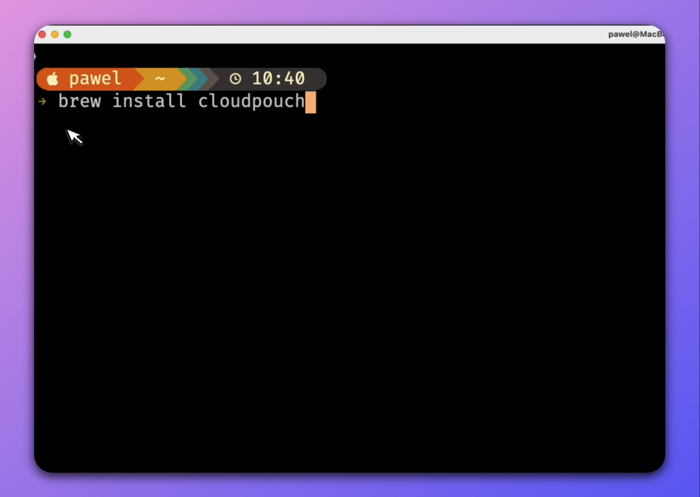

🌐 [Website](https://cloudpouch.dev) • 🚀 [Releases](https://github.com/CloudPouch/CloudPouch.dev/releases) • 💳 [Buy license](https://cloudpouch.dev/#pricing) • 📖 [User Guide](https://github.com/CloudPouch/CloudPouch.dev/blob/main/userGuide/user-guide.md)

On this page:

* [What is CloudPouch?](#what-is-cloudpouch)
  * [Cost Insights - automatically find saving opportunities](#cost-insights---automatically-find-saving-opportunities)
* [AWS Credentials & Profiles](#aws-credentials--profiles)
  * [AWS SSO Configuration](#aws-sso-configuration)
* [How to install?](#how-to-install)
  * [Install on macOS using `brew`](#install-on-macos-using-brew)

# What is CloudPouch?
CloudPouch is an advanced FinOps tool designed for AWS cloud cost optimization. It analyzes AWS usage, identifies unnecessary expenses, and provides actionable recommendations. The app is tailored for cloud architects, DevOps, and FinOps specialists, enabling fast detection of cost anomalies, resource waste, and optimization opportunities.

It offers granular, actionable insights across EC2, RDS, EBS, ECR, S3, VPC, Glue, DynamoDB, DocumentDB, CloudWatch, and ELB. Its rich UI, data drill-down capabilities, anomaly detection, and direct CloudWatch integration make it an indispensable tool for AWS cost optimization experts.


## Cost Insights - automatically find saving opportunities

CloudPouch offers built-in automations called ***Cost Insights*** that identify cost-saving opportunities across various AWS services. These include:

### 1. **Amazon EC2 (Elastic Compute Cloud)**  
- Detects unused or underutilized instances for rightsizing or termination.
- Recommends optimal instance sizes based on CPU, memory, and network usage.

### 2. **Amazon EC2 - EBS (Elastic Block Storage)**  
- Identifies unattached (orphaned) EBS volumes.
- Identifies EBS volumes attached to shutdown instances.
- Recommends migration from GP2 to GP3 volumes for better cost-performance ratios.
- Analyzes incremental snapshots to identify deletable EBS snapshots.

### 3. **Amazon RDS (Relational Database Service)**  
- Identifies unused databases incurring storage costs.
- Detects over-provisioned DB instances for potential rightsizing.
- Highlights storage autoscaling behavior and disk utilization issues.

### 4. **Amazon S3 (Simple Storage Service)**  
- Analyzes storage tiers and suggests lifecycle policies or Intelligent-Tiering to reduce costs.
- Monitors average storage costs (price per GB) per bucket for optimization.

### 5. **AWS Glue**  
- Analyzes Glue Crawlers to optimize execution frequency and schedule configurations.
- Evaluates Glue Jobs for potential configuration improvements and identifies failed jobs incurring unnecessary costs.

### 6. **Amazon DynamoDB**  
- Identifies over-provisioned tables.
- Suggests implementing auto-scaling to enhance cost efficiency.
- Highlights tables at risk due to excessive burst capacity usage.

### 7. **AWS DocumentDB (with MongoDB compatibility)**  
- Identifies idle clusters suitable for removal or optimization.
- Suggests instance rightsizing or migration to cost-effective instance types (including AWS Graviton).

### 8. **Amazon VPC (Virtual Private Cloud)**  
- Identifies unnecessary NAT Gateways based on CloudWatch metrics.
- Analyzes Gateway and Interface endpoints to minimize expensive data transfer costs.

### 9. **Elastic Load Balancer (ELB)**  
- Detects unused ELBs or those without active target groups, generating unnecessary costs.

### 10. **Elastic IP Addresses (EIP)**  
- Finds Elastic IPs not associated with active EC2 instances, generating idle charges.

### 11. **Amazon ECR (Elastic Container Registry)**  
- Identifies outdated or unused container images for cleanup to optimize storage costs.

### 12. **AWS CloudWatch**  
- Highlights excessive or unnecessary CloudWatch Logs storage and ingestion costs.

**Summary**:  
CloudPouch’s "Cost Insights" automatically analyzes resource utilization and configurations across the above AWS services, providing clear recommendations for optimizing resources, reducing cloud spend, and eliminating redundant or wasteful expenses.


---
# AWS Credentials & Profiles

CloudPouch reads the same AWS configuration files as the [AWS CLI](https://aws.amazon.com/cli/):

- **Static credentials** (IAM user keys) → `~/.aws/credentials`  
- **SSO profiles** → `~/.aws/config`  

---

## AWS SSO Configuration

CloudPouch supports the AWS CLI’s new SSO session sharing format, which lets you define a single `sso-session` block and reference it from multiple profiles. This reduces duplication and makes SSO management easier.

### Sample `~/.aws/config`

```ini
[profile my-dev-profile]
sso_session       = my-sso
sso_account_id    = 123456789011
sso_role_name     = readOnly
region            = us-west-2

[profile my-other-profile]
sso_session       = my-sso
sso_account_id    = 555555555555
sso_role_name     = readOnly
region            = us-west-2

[sso-session my-sso]
sso_region              = us-east-1
sso_start_url           = https://my-sso-portal.awsapps.com/start
sso_registration_scopes = sso:account:access
```
**Tip**: You can reference the same sso-session `my-sso` from as many profiles as you need.

For full details, see the [AWS CLI SSO guide](https://docs.aws.amazon.com/cli/latest/userguide/cli-configure-sso.html) or read my article [Simplified Configuration of SSO Profiles in AWS CLI Using SSO Sessions](https://dev.to/aws-heroes/simplified-configuration-of-sso-profiles-in-aws-cli-using-sso-sessions-8hh).


# How to install?

CloudPouch is available for Windows, macOS, and Linux.

Visit https://cloudpouch.dev homepage and click "TRY FOR FREE" yellow button.  
The site detects your operating system and downloads the correct installer automatically.

## Install on macOS using `brew`

If you are using macOS and Homebrew you can install CloudPouch by executing single command

```
brew install cloudpouch
```

Need a quick walkthrough? Watch the short demo video on [YouTube](https://www.youtube.com/watch?v=-kG0WIC3x8I).

[](https://www.youtube.com/watch?v=-kG0WIC3x8I "Watch the demo")