# CloudPouch
[Website](https://cloudpouch.dev) • [Releases](https://github.com/CloudPouch/CloudPouch.dev/releases) • [Buy license](https://cloudpouch.dev/#pricing) • [User Guide](https://github.com/CloudPouch/CloudPouch.dev/blob/main/userGuide/user-guide.md)

# What is CloudPouch
CloudPouch is an advanced FinOps tool designed for AWS cloud cost optimization. It analyzes AWS usage, identifies unnecessary expenses, and provides actionable recommendations. The app is tailored for cloud architects, DevOps, and FinOps specialists, enabling fast detection of cost anomalies, resource waste, and optimization opportunities.

It offers granular, actionable insights across EC2, RDS, EBS, ECR, S3, VPC, Glue, DynamoDB, DocumentDB, CloudWatch, and ELB. Its rich UI, data drill-down capabilities, anomaly detection, and direct CloudWatch integration make it an indispensable tool for AWS cost optimization experts.

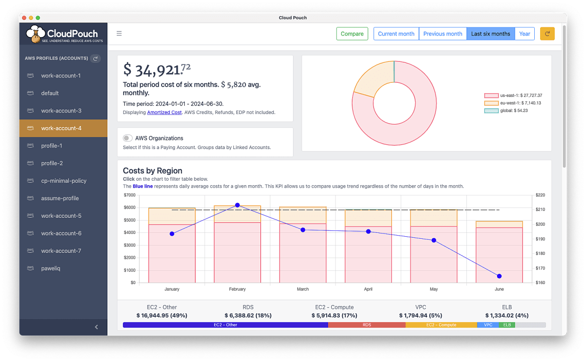

## Cost Insights - automatically find saving opportunities

CloudPouch offers built-in automations called ***Cost Insights*** that identify cost-saving opportunities across various AWS services. These include:

### 1. **Amazon EC2 (Elastic Compute Cloud)**  
- Detects unused or underutilized instances for rightsizing or termination.
- Recommends optimal instance sizes based on CPU, memory, and network usage.

### 2. **Amazon EC2 - EBS (Elastic Block Storage)**  
- Identifies unattached (orphaned) EBS volumes.
- Identifies EBS volumes attached to shutdown instances.
- Recommends migration from GP2 to GP3 volumes for better cost-performance ratios.
- Analyzes incremental snapshots to identify deletable EBS snapshots.

### 3. **Amazon RDS (Relational Database Service)**  
- Identifies unused databases incurring storage costs.
- Detects over-provisioned DB instances for potential rightsizing.
- Highlights storage autoscaling behavior and disk utilization issues.

### 4. **Amazon S3 (Simple Storage Service)**  
- Analyzes storage tiers and suggests lifecycle policies or Intelligent-Tiering to reduce costs.
- Monitors average storage costs (price per GB) per bucket for optimization.

### 5. **AWS Glue**  
- Analyzes Glue Crawlers to optimize execution frequency and schedule configurations.
- Evaluates Glue Jobs for potential configuration improvements and identifies failed jobs incurring unnecessary costs.

### 6. **Amazon DynamoDB**  
- Identifies over-provisioned tables.
- Suggests implementing auto-scaling to enhance cost efficiency.
- Highlights tables at risk due to excessive burst capacity usage.

### 7. **AWS DocumentDB (with MongoDB compatibility)**  
- Identifies idle clusters suitable for removal or optimization.
- Suggests instance rightsizing or migration to cost-effective instance types (including AWS Graviton).

### 8. **Amazon VPC (Virtual Private Cloud)**  
- Identifies unnecessary NAT Gateways based on CloudWatch metrics.
- Analyzes Gateway and Interface endpoints to minimize expensive data transfer costs.

### 9. **Elastic Load Balancer (ELB)**  
- Detects unused ELBs or those without active target groups, generating unnecessary costs.

### 10. **Elastic IP Addresses (EIP)**  
- Finds Elastic IPs not associated with active EC2 instances, generating idle charges.

### 11. **Amazon ECR (Elastic Container Registry)**  
- Identifies outdated or unused container images for cleanup to optimize storage costs.

### 12. **AWS CloudWatch**  
- Highlights excessive or unnecessary CloudWatch Logs storage and ingestion costs.

**Summary**:  
CloudPouch’s "Cost Insights" automatically analyzes resource utilization and configurations across the above AWS services, providing clear recommendations for optimizing resources, reducing cloud spend, and eliminating redundant or wasteful expenses.


---

## Minimal IAM User privileges
If you want to use a dedicated IAM user with minimal privileges please use the following policy:
```JSON
{
    "Version": "2012-10-17",
    "Statement": [
        {
            "Sid": "CloudPouchMinimalAccess",
            "Effect": "Allow",
            "Action": [
                "application-autoscaling:DescribeScalableTargets",
                "ce:GetCostAndUsage",
                "cloudwatch:GetMetricStatistics",
                "dynamodb:DescribeTable",
                "dynamodb:ListTables",
                "ec2:Describe*",
                "ebs:ListSnapshotBlocks",
                "ebs:ListChangedBlocks",
                "elasticloadbalancing:DescribeLoadBalancers",
                "elasticloadbalancing:DescribeTargetGroups",
                "elasticloadbalancing:DescribeTargetHealth",
                "logs:DescribeLogGroups",
                "organizations:ListAccounts",
                "rds:DescribeDBClusters",
                "rds:DescribeDBInstances",
                "rds:DescribeDBSnapshots"
            ],
            "Resource": "*"
        }
    ]
}
```
Last change for version [1.24.0](https://github.com/CloudPouch/CloudPouch.dev/releases/tag/v1.24.0).

## Optional: Configuring Certificates in CloudPouch Application
The CloudPouch includes an option that enables users to configure and use a certificate when connecting to the internet. This feature is particularly beneficial for users operating within corporate networks that frequently have stringent security protocols, often mandating certificate use for internet resource access.

The CloudPouch supports the use of custom and global SSL/TLS certificates in PEM format (`.pem`). These could be certificates issued by widely recognized CAs, or those signed by private or self-signed authorities. Please make sure to specify the correct path to your certificate when configuring your CloudPouch application.

To set up the certificate, please define the path to the certificate file in the `config.json` file, as shown below:
```JSON
{
  "certificatePath": "<Path to your .pem certificate file>"
}
```

Here, `certificatePath` should contain the full path to your `.pem` file, including the file name. Please ensure you have the necessary read permissions to access this file.

Ensure to restart the CloudPouch application for the new certificate settings to take effect.

Should you need more detailed information about supported certificates, refer to the public documentation regarding `AWS_CA_BUNDLE` and `NODE_EXTRA_CA_CERTS` on the Internet.

### File location
The `config.json` file location depends on the OS you're using:

* MacOs - `/Users/<YOUR_USER_NAME>/Library/Application Support/CloudPouch/config.json`
* Windows - `c:\Users\<YOUR_USER_NAME>\AppData\Roaming\CloudPouch\config.json`
* Linux - `~/.config/CloudPouch/config.json`


Certificate support was introduces in version [1.25.0](https://github.com/CloudPouch/CloudPouch.dev/releases/tag/v1.25.0).

## Create CloudFormation stack
Click this button to create `CloudPouch-access-policy-stack` on your AWS account with the IAM policy that you can attach to any IAM Role or IAM User.

[](https://console.aws.amazon.com/cloudformation/home#/stacks/new?stackName=CloudPouch-access-policy-stack&templateURL=https://cloudpouch-public.s3.amazonaws.com/cloudformation-policy.yml)

<details>
<summary><b>Step-by-step guide of CloudFormation deployment</b></summary><p>

1. This is the first CloudFormation service console with the template already pre-loaded. Click `Next`.
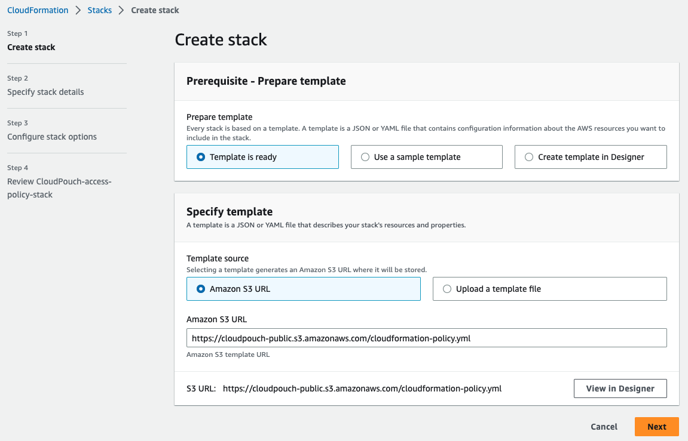
1. There are parameters to set. Click `Next`.
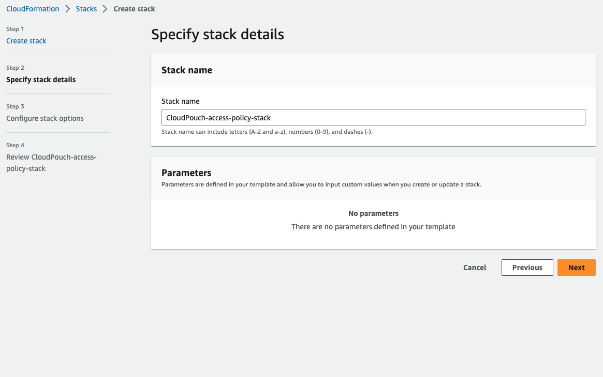
1. Leaver everything as is. Click `Next`.
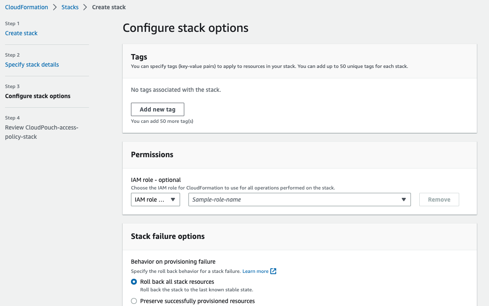
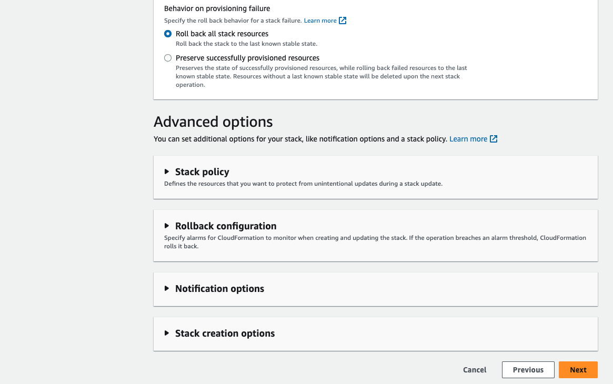
1. Review and click `Next`.
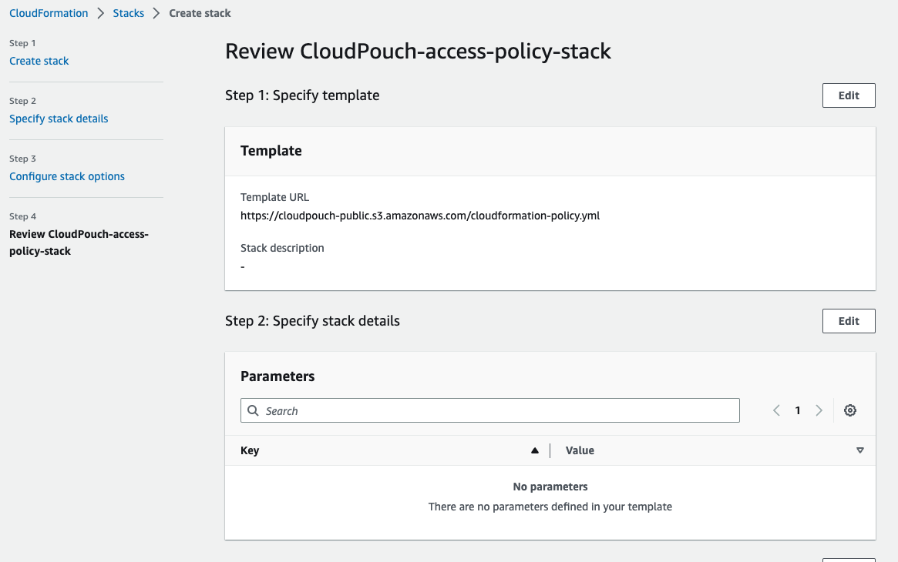
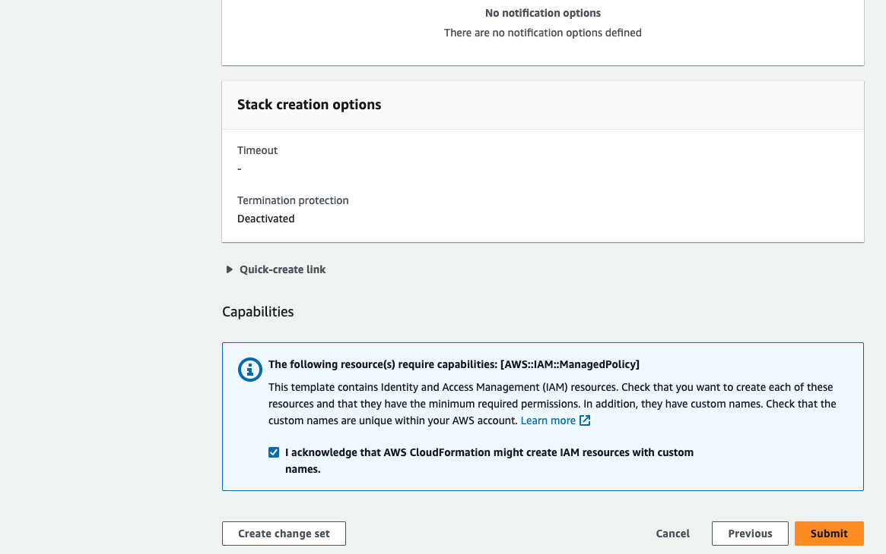
1. CloudFormation deployment starts.
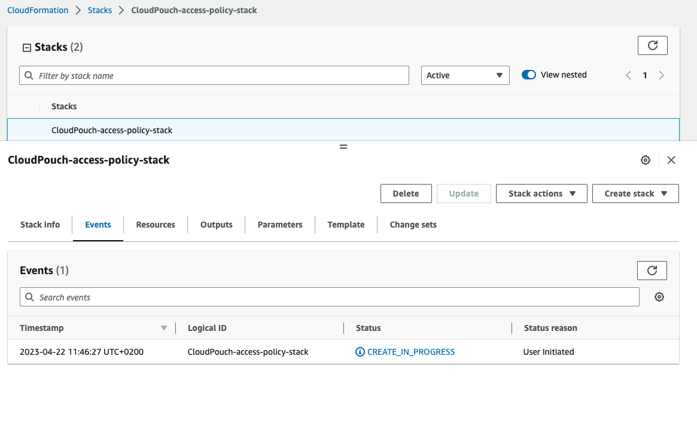
1. After a moment it is finished.
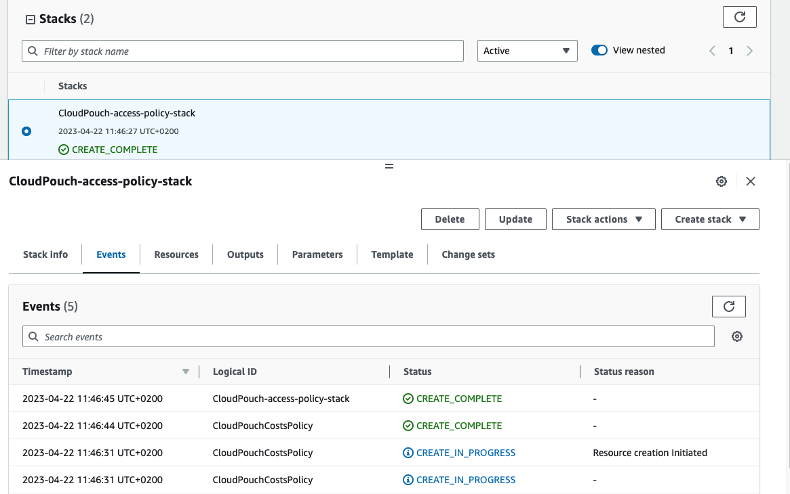
1. Go to [IAM Policies](https://us-east-1.console.aws.amazon.com/iamv2/home#/policies) tab and find the policy named `CloudPouch-costs-policy`.
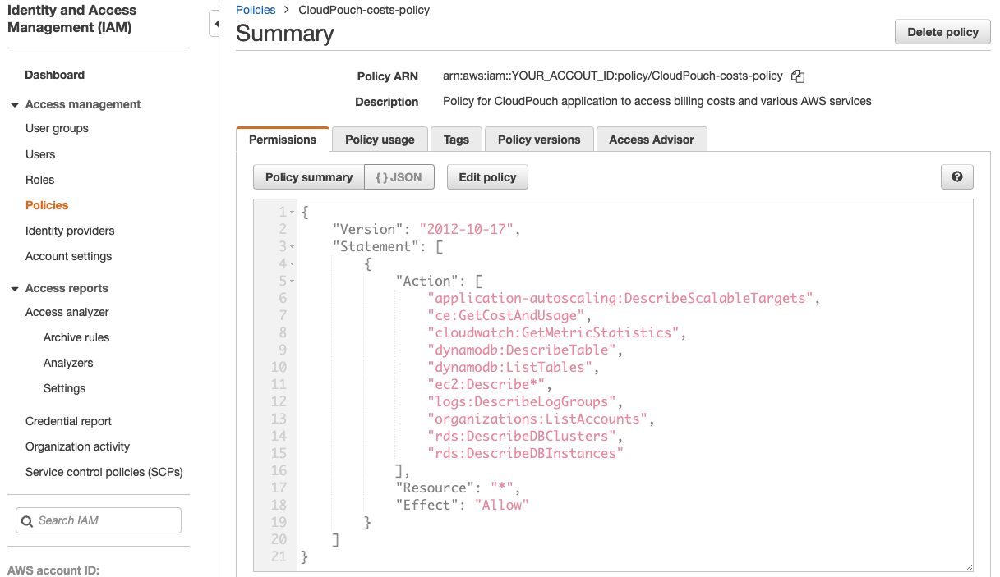
1. Now you need to add this policy to an IAM User or a Role.
</p>
</details>

<br />

### Attach policy to an IAM User
1. After Policy is created go to the [IAM Users tab](https://us-east-1.console.aws.amazon.com/iamv2/home?region=us-east-1#/users), select a user and click `Add Permissions` button (select again `Add Permissions` from the dropdown list).
1. Select `Attach policies directly` and in the search below enter the name of the newly created IAM Policy: `CloudPouch-costs-policy` 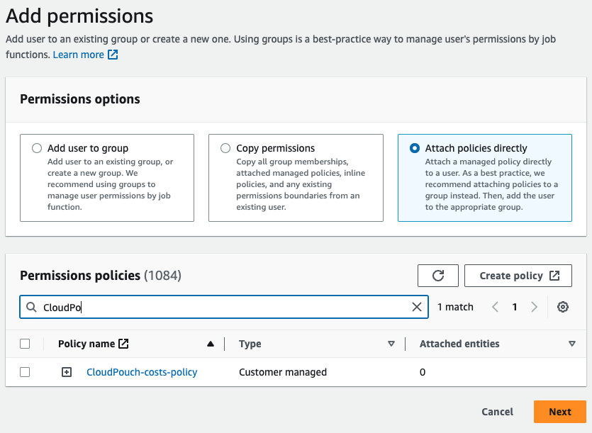
1. Tick checkbox next the it and click `Next`
1. On the next screen click `Add Permissions` button.
1. Done ✅
### Policy explanation
#### Necessary privileges
* `ce:GetCostAndUsage` is crucial as allows to fetch cost data. 
* `organizations:ListAccounts` used to resolve names of your accounts in the AWS Organizations. Used only when you have paying account.

#### Insights privileges 
Insights check your resources in the AWS cloud and provide useful information for cost optimization. They can detect *waste*, for example unattached EBS drives or wrongly configured resources such as over-provisioned DynamoDB tables.

* EC2 - Other insights use following privileges:
    * `ec2:Describe*`
* DynamoDB insights use:
    * `dynamodb:DescribeTable`
    * `dynamodb:ListTables`
    * `cloudwatch:GetMetricStatistics`
    * `application-autoscaling:DescribeScalableTargets`
* CloudWatch insights use:
    * `logs:DescribeLogGroups`
* RDS insights use:
    - `rds:DescribeDBClusters`
    - `rds:DescribeDBInstances`
    - `rds:DescribeDBSnapshots`
* ELB insights use:
    - `elasticloadbalancing:DescribeLoadBalancers`
    - `elasticloadbalancing:DescribeTargetGroups`
    - `elasticloadbalancing:DescribeTargetHealth`


## AWS SSO Configuration
To use AWS SSO you need to properly configure your SSO profile (in `~/.aws/config` file), according to the AWS documentation [Configuring the AWS CLI to use AWS Single Sign-On](https://docs.aws.amazon.com/cli/latest/userguide/cli-configure-sso.html).
