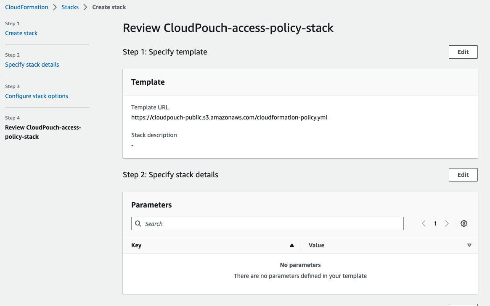
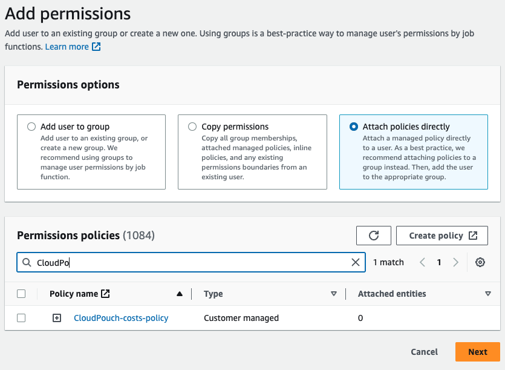

# CloudPouch User Guide

Table of contents

- [Configuration files](#configuration-files)
- [Logs](#logs)
- [Cached data](#cached-data)
- [Minimal IAM User privileges](#minimal-iam-user-privileges)
- [Configuring Certificates in CloudPouch Application for Zscaler](#configuring-certificates-in-cloudpouch-application-for-zscaler)
  - [Why Certificate Support?](#why-certificate-support)
  - [Configuration](#configuration-1)
  - [File Location](#file-location)
- [Create access policy via CloudFormation stack](#create-access-policy-via-cloudformation-stack)
- [Attach policy to an IAM User](#attach-policy-to-an-iam-user)
- [Policy explanation](#policy-explanation)
  - [Necessary privileges](#necessary-privileges)
  - [Insights privileges](#insights-privileges)
- [Troubleshooting](#troubleshooting)
  - [Ubuntu Linux problem](#ubuntu-linux-problem)

## Configuration files
The `config.json` file location depends on the OS you're using:

* MacOs - `/Users/<YOUR_USER_NAME>/Library/Application Support/CloudPouch/config.json`
* Windows - `c:\Users\<YOUR_USER_NAME>\AppData\Roaming\CloudPouch\config.json`
* Linux - `~/.config/CloudPouch/config.json`
## Logs
The `main.log` file location depends on the OS you're using:

* MacOs - `/Users/<YOUR_USER_NAME>/Library/Logs/CloudPouch`
* Windows - `c:\Users\<YOUR_USER_NAME>\AppData\Roaming\CloudPouch\logs`
* Linux - `~/.config/CloudPouch/`

## Cached data
CloudPouch stores cached data as JSON files on your local hard drive:
* MacOs - `/Users/<YOUR_USER_NAME>/Library/Application Support/CloudPouch/data`
* Windows - `c:\Users\<YOUR_USER_NAME>\AppData\Roaming\CloudPouch\data`
* Linux - ``


## Minimal IAM User privileges
If you want to use a dedicated IAM user with minimal privileges please use the following policy:
```JSON
{
    "Version": "2012-10-17",
    "Statement": [
        {
            "Sid": "CloudPouchMinimalAccess",
            "Effect": "Allow",
            "Action": [
                "application-autoscaling:DescribeScalableTargets",
                "ce:GetCostAndUsage",
                "cloudwatch:GetMetricStatistics",
                "dynamodb:DescribeTable",
                "dynamodb:ListTables",
                "ec2:Describe*",
                "ebs:ListSnapshotBlocks",
                "ebs:ListChangedBlocks",
                "elasticloadbalancing:DescribeLoadBalancers",
                "elasticloadbalancing:DescribeTargetGroups",
                "elasticloadbalancing:DescribeTargetHealth",
                "logs:DescribeLogGroups",
                "organizations:ListAccounts",
                "rds:DescribeDBClusters",
                "rds:DescribeDBInstances",
                "rds:DescribeDBSnapshots"
            ],
            "Resource": "*"
        }
    ]
}
```
Last change for version [1.24.0](https://github.com/CloudPouch/CloudPouch.dev/releases/tag/v1.24.0).

## Configuring Certificates in CloudPouch Application for Zscaler

CloudPouch supports the use of custom and global SSL/TLS certificates in PEM format (`.pem`). This feature ensures secure connections in environments with strict certificate requirements, such as corporate networks that intercept or re-sign HTTPS traffic with an internal Certificate Authority (CA).

### Why Certificate Support?

In many enterprise setups, security appliances or proxy services perform TLS inspection—decrypting and scanning outbound traffic for malware or data exfiltration, then re-encrypting it with a corporate CA. Without trusting the corporate CA, client applications will fail to establish HTTPS connections due to unrecognized or untrusted certificates. By allowing you to specify a custom PEM certificate bundle, CloudPouch can trust these intercepted connections and communicate successfully.

Common corporate solutions that enforce TLS inspection include:

- **Zscaler Internet Access**
- **Blue Coat (Symantec) ProxySG**
- **F5 BIG-IP SSL Orchestrator**

### Configuration

To configure CloudPouch to use your custom certificate:

1. Open your `config.json` file.  
2. Define the path to your `.pem` certificate bundle:

```json
   {
     "certificatePath": "<Path to your .pem certificate file>"
   }
```

-	`certificatePath` should contain the full path (absolute, not relative path) to your PEM file, including the file name.
-	Ensure the application has **read permissions** for this file.

3. Restart the CloudPouch application for the changes to take effect.

### File Location
The location of `config.json` varies by operating system:

- **macOS**: `/Users/<YOUR_USER_NAME>/Library/Application Support/CloudPouch/config.json`
- **Windows**: `C:\Users\<YOUR_USER_NAME>\AppData\Roaming\CloudPouch\config.json`
- **Linux**: `~/.config/CloudPouch/config.json`

Certificate support was introduced in version [1.25.0](https://github.com/CloudPouch/CloudPouch.dev/releases/tag/v1.25.0), explicitly enabling custom SSL/TLS certificates to accommodate corporate proxy requirements. For more details, see the public documentation on `AWS_CA_BUNDLE` and `NODE_EXTRA_CA_CERTS`.

## Create access policy via CloudFormation stack
Click this button to create `CloudPouch-access-policy-stack` on your AWS account with the IAM policy that you can attach to any IAM Role or IAM User.

[](https://console.aws.amazon.com/cloudformation/home#/stacks/new?stackName=CloudPouch-access-policy-stack&templateURL=https://cloudpouch-public.s3.amazonaws.com/cloudformation-policy.yml)

<details>
<summary><b>Step-by-step guide of CloudFormation deployment</b></summary><p>

1. This is the first CloudFormation service console with the template already pre-loaded. Click `Next`.

1. There are parameters to set. Click `Next`.

1. Leaver everything as is. Click `Next`.


1. Review and click `Next`.


1. CloudFormation deployment starts.

1. After a moment it is finished.

1. Go to [IAM Policies](https://us-east-1.console.aws.amazon.com/iamv2/home#/policies) tab and find the policy named `CloudPouch-costs-policy`.

1. Now you need to add this policy to an IAM User or a Role.
</p>
</details>

<br />

### Attach policy to an IAM User
1. After Policy is created go to the [IAM Users tab](https://us-east-1.console.aws.amazon.com/iamv2/home?region=us-east-1#/users), select a user and click `Add Permissions` button (select again `Add Permissions` from the dropdown list).
1. Select `Attach policies directly` and in the search below enter the name of the newly created IAM Policy: `CloudPouch-costs-policy` 
1. Tick checkbox next the it and click `Next`
1. On the next screen click `Add Permissions` button.
1. Done ✅
### Policy explanation
#### Necessary privileges
* `ce:GetCostAndUsage` is crucial as allows to fetch cost data. 
* `organizations:ListAccounts` used to resolve names of your accounts in the AWS Organizations. Used only when you have paying account.

#### Insights privileges 
Insights check your resources in the AWS cloud and provide useful information for cost optimization. They can detect *waste*, for example unattached EBS drives or wrongly configured resources such as over-provisioned DynamoDB tables.

* EC2 - Other insights use following privileges:
    * `ec2:Describe*`
* DynamoDB insights use:
    * `dynamodb:DescribeTable`
    * `dynamodb:ListTables`
    * `cloudwatch:GetMetricStatistics`
    * `application-autoscaling:DescribeScalableTargets`
* CloudWatch insights use:
    * `logs:DescribeLogGroups`
* RDS insights use:
    - `rds:DescribeDBClusters`
    - `rds:DescribeDBInstances`
    - `rds:DescribeDBSnapshots`
* ELB insights use:
    - `elasticloadbalancing:DescribeLoadBalancers`
    - `elasticloadbalancing:DescribeTargetGroups`
    - `elasticloadbalancing:DescribeTargetHealth`


# Troubleshooting

## Ubuntu Linux problem

When application doesn't want to start on Linux, check logs for `GPU process isn't usable. Goodbye.` message. Something similar to:

```
12:48:08.895 › Checking for update
12:48:08.931 › Generated new staging user ID: 08751b29-ea12-5a1c-b8b6-4256748d7cd6
(node:708150) ExtensionLoadWarning: Warnings loading extension at /home/<USER_NAME>/.config/CloudPouch/extensions/lmhkpmbekcpmknklioeibfkpmmfibljd:
  Unrecognized manifest key 'commands'.
  Unrecognized manifest key 'homepage_url'.
  Unrecognized manifest key 'page_action'.
  Unrecognized manifest key 'short_name'.
  Unrecognized manifest key 'update_url'.
  Permission 'notifications' is unknown or URL pattern is malformed.
  Permission 'contextMenus' is unknown or URL pattern is malformed.
  Cannot load extension with file or directory name _metadata. Filenames starting with "_" are reserved for use by the system.

(Use `cloudpouch --trace-warnings ...` to show where the warning was created)
Added Extension:  Redux DevTools
12:48:10.316 › Update for version 1.19.0 is not available (latest version: 1.19.0, downgrade is disallowed).
12:48:10.317 › checkForUpdatesAndNotify called, downloadPromise is null
[708150:0727/124810.448196:FATAL:gpu_data_manager_impl_private.cc(415)] GPU process isn't usable. Goodbye.
Trace/breakpoint trap (core dumped)
```
### solution
Run application with `--in-process-gpu` parameter. For example:
```
./Downloads/CloudPouch-1.19.0.AppImage --in-process-gpu
```
